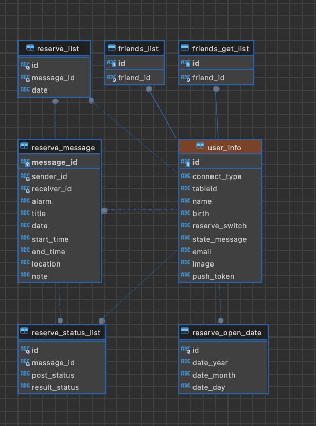

README.md
# 목차
[1. 개발 일지](#개발-일지)   
[2. 생각 거리](#생각-거리)

--- 
---

# 개발 일지
### 2024.01.29
<details>
<summary>내용</summary>

1. common 단 변화 시도 및 각종 VC들 변환 작업 중

</details> 

### 2024.01.28
<details>
<summary>내용</summary>

1. UI 작성 코드들 모듈화(?) 처리를 통해서 중복되는 코드 줄임
    - Common.TopView 변환 작업 중
    - MainVC 변환 작업 중

</details> 

### 2024.01.26
<details>
<summary>내용</summary>

1. Coordinator 패턴 적용 중 
    - AppCoordinator 생성
    - IntroCoordinator 생성 - IntroVC 와 적용
    - LoginCoordinator 생성 - LoginVC 와 적용
    - MainCoordinator 생성 - MainVC 미적용
2. .xib -> SnapKit Code 전환
    - IntroVC 에 대한 화면 UI 코드 전환 완료
    - LoginVC 에 대한 화면 UI 코드 전환 완료
    - MainVC 화면 UI 코드 전환 중
3. VC 기능 동작 확인
    - IntroVC 패턴 적용하고 코드 전환 후 기능 적용 완료
    - LoginVC 패턴 적용하고 코드 전환 후 기능 적용 완료
    - MainVC 전환 적용 중

</details> 

### 2024.01.25
<details>git 
<summary>내용</summary>

1. 프로젝트 진행 방향에 대한 생각 변경
    - 최대한 빠르게 만들어지는 대로 만들어서 앱을 스토어에 올릴 생각이었으나 데이터를 관리하는 서버와 DB단의 변경으로 인해서 프로젝트 자체의 대규모 변경이 필요함을 느낌

2. 변경 내용
    1. iOS APP 관련
        - Design Pattern 도입 (Coordinator Pattern, Observer Pattern)
        - UI 작성 방식 변경 (xib -> code)
        - 서버가 추가 됨으로 인해 내부 로직들 대거 변경
    2. 서버 추가
        - firebase 의 realTime DB를 활용한 데이터 이용을 하였으나 실 서버에 대한 필요성을 느끼게 되어 서버를 추가 하기로 결정
        - 물리적인 서버는 개인 NAS가 존재하여 해당 기기를 활용
        - Back 단은 Node.js 를 사용
        - DB 는 MongoDB(MySQL) 를 사용
    3. MongoDB 에 테이블 생성
    <div align = center>
        
    </div>
        


</details> 

### 2024.01.22
<details>
<summary>내용</summary>

1. 개발 무기한 중단
    - 서버 및 데이터 전환 작업
        - firebase -> node.js
        - firebase.realtiemDB -> MariaDB

</details> 

### 2024.01.18
<details>
<summary>내용</summary>

1. 예약 PAGE 수정
    - 뒤에 시간 건들고 앞에 건들면 뒤에꺼 날아가는 오류
2. Main 자체에서 오류들 발생
    - 싹다 로직 전체 수정으로 해결

</details> 

### 2024.01.17
<details>
<summary>내용</summary>

1. 예약 PAGE 완료
    - 예약 관련 부분 완료
2. Main 자체에서 오류들 발생
    - 문제
        1. 처음 가입시 이름이 Name으로 표기되는 오류
        2. 예약 받고 나면 떠있는 창 지우고 오늘의 일정에 해당되면 오늘의 일정에도 띄우는 작업을 진행해야 함
            - 당연 예약을 준사람도 작업을 해줘야 함
        3. 친구 추가 했을 떄 친구 요청을 갱신해야 받아오는데 이부분을 Main에서 하기에 해당 창 진입시 데이터 불러오게 변경
        4. 오늘의 일정에서 알림 토글 부분에 문제가 있음
        5. 친구cell에 있는 버튼 누르고 다른 VC 갔다가 돌아오면 친구cell 버튼이 동작을 안함
    - Main 자체에 Logic에서 문제점을 다수 발생하여 해당 부분을 전면 수정 중

</details> 

### 2024.01.16
<details>
<summary>내용</summary>

1. 예약 PAGE view 작동
    - DB 작업해서 다른 아이디에서도 아무 이상없이 잘 뜨는지 확인 필요
2. Add Friends 부분에서 문제점이 발견
    - 친구 조회가 안되는 문제가 발견 
        - 검색하는 DBManager 부분이 오류가 생긴듯

</details> 

### 2024.01.13
<details>
<summary>내용</summary>

1. SecondReserveView 추가
    - View 추가
2. reserveData 추가해서 데이터 모델변경

</details> 

### 2024.01.10
<details>
<summary>내용</summary>

1. SearchAddressView 추가
    - 주소 입력하는데 Map을 보여줄 필요는 없다는 판단이 들어서 해당 부분을 Kakao의 주소 검색 API를 사용하기로 함
    - 따로 라이브러리로 존재하는것이 아니라 직접 HTML로 깃 허브에 올려둔 상태에서 Handler로 받아서 사용하는 WebView 형식으로 만들었음
2. ReserveView 정리
    - 날짜 선택과 관련한 오류들 수정
    - 빈 값인데도 스크롤이 되는 오류 수정
    - 날짜, 시간, 장소 저장까지는 완료 이제 다음 예약 로직으로 넘어가면 됨

</details> 

### 2024.01.09
<details>
<summary>내용</summary>

1. View 다듬기
    - NaverView 와 ReserveView 가 조금더 자연스러울 수 있게 다듬기
</details> 

### 2024.01.07
<details>
<summary>내용</summary>

1. MapView
    - 지도의 권한 허용 팝업 멘트 설정 및 권한 동작 구현
    - 현재 위치의 좌표를 받아와 현재 위치로 이동
</details>  

### 2024.01.06
<details>
<summary>내용</summary>

1. ReserveView: datePicker 수정   
    - 오늘 날짜보다 이전 예약은 막아야 하는데 내부 로직 상 날짜 입력이 제대로 처리 되지 않아 수정  
    - yyyyMMdd 로 되어야 하는데 두자리 수 미만의 [월,일]이 입력되는 경우에 yyyyMd 와 같이 이상한 형태로 들어오는것을 확인 하였음
2. ReserveView: MapView_searchView 수정  
    -  지도 확인을 위해 띄우는 VC에서 AutoLayout 설정과 꺼졌다 켜짐 등에 대한 부분을 수정
</details>  

### 2024.01.05
<details>
<summary>내용</summary>

1. Git 등록  
    - Local 관리를 하다가 체계적인 관리의 필요성을 다시 느껴서 작업물을 Git에 등록
2. 내부 로직 수정  
    - 내부 로직을 대대로 수정하면서 "InputUserInfoView" 와의 연결이 끊겨 있는 문제를 수정

</details>


---
---
   
# 생각 거리

### 생각중
<details>
<summary>2024.01.06</summary>

```
[ ] 1. ViewDelegate와  BaseVCDelegate 를 활용하는데 이 부분을 나중에 다른 요소로 대체를 할 수 있으면 해야 할 것으로 보임 
```
> 이건 너무 과하게 전 범위를 커버치려고 하다보니 세세하게 하나하나 다 고려를 해야 하고 값을 넣어줘야 하는 문제가 있음을 느낌

</details>

### 실행
<details>
<summary>2024.01.05</summary>

```
[✓] 1. DatabaseManager의 Delegate 부분이 너무나도 불편하게 구성이 되어있음 completion 방식으로 변경 하는게 어떠할까 함
```
> 불편하게 구성이 되어있다보니 common 단으로 구성을 했음에도 불구하고 계속해서 특정 상황에 맞는 매개변수를 추가하고 하는 이상한 짓을 하게 되어서 수정을 해야 함을 느낌

</details>